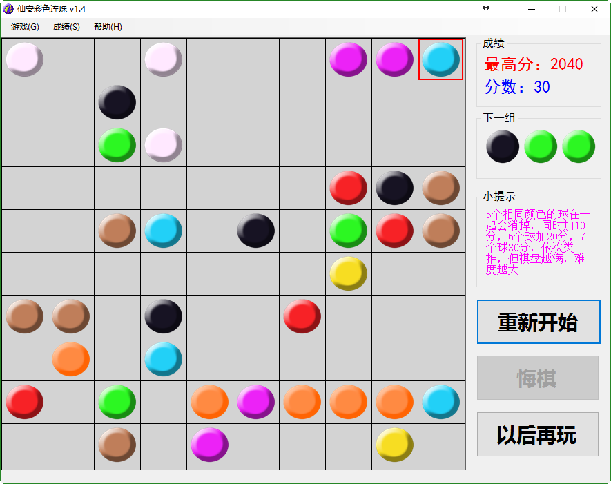

# colorball

一款C#开发的桌面小游戏，还是2010年写的，灵感来自于一款手机游戏。

# 运行相关

使用`Visual Studio 2010`开发，最低要求`.Net Framework 4.0`，有生成好的exe文件可供直接运行，最新版本为v1.4。

# 其它说明

由于本人已转行，多年不接触`C#`，所以这个应该不会再维护了，碰到问题自己解决吧。之前倒是写了一个JS版的彩色连珠，有时间也把源码贴上来。

几年前写的详细博客介绍：http://www.cnblogs.com/liuxianan/archive/2012/07/19/2598446.html

游戏截图：

特别说明：白色的球是可以当成任意颜色与其它球一起消除的，所以不要以为是bug。